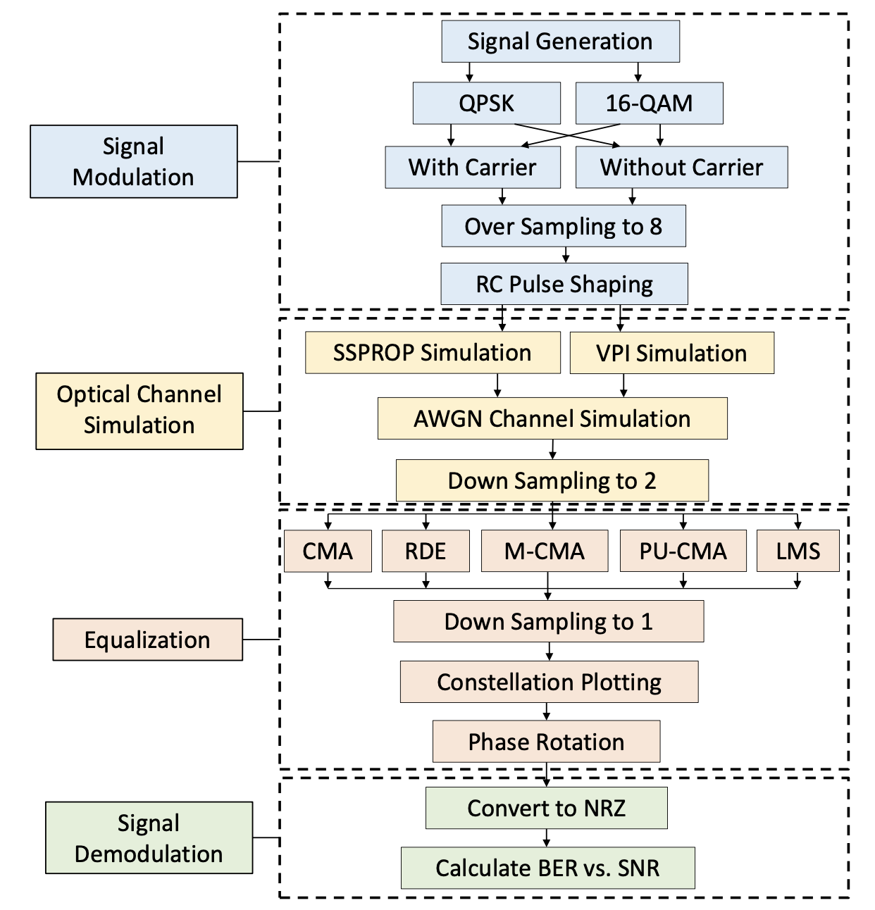
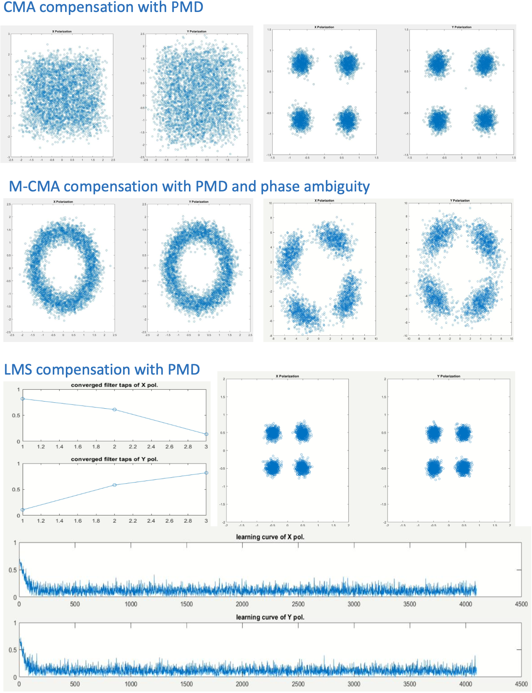

# Polarization Demultiplexing for Optical Communication Systems
## Introduction
Polarization Mode Dispersion (PMD) is an emerging issue when transmission rate has reached 10GHz. Since PMD effect increase with square of distance. It imposes challenges for long distance transmission and should take into consideration. Currently There have been multiple methods from different part of communication system to eliminate PMD effect such as polarization maintaining fiber and fiber Bragg grating (FBG).
However, these methods are based on hardware at transmitter and fiber. Another emerging method is based on DSP techniques which will be used in this project. The widely implementation of DSP also depends on the development of coherent detection, which detects phase and amplitude of the receive signal. Previous studies about PMD with DSP have focused on blind equalization techniques such as Constant Modulus Algorithm (CMA) and Least Mean Square (LMS) methods and discussed their performance individually, but comparisons of each algorithms are lacked, and optimal settings of each parameters are not mentioned.
## Objective
• Correctly modulate and demodulate QPSK signal.
• Simulate PMD effect by SSPROP and VPI Photonics.
• Compare different compensator design and propose the implementation strategy.
## Methodology
 
The project mainly uses adaptive equalization include CMA, LMS and RDE for PMD compensation. In addition to the analysis of each related parameters, these algorithms will be compared, and suggestion of implementation will be provided. Two major optimization benchmarks of this project are computation speed and compensation ability measured by convergent speed and constellations diagram respectively, since high speed DSP is required for real- time compensation and such filter can be used for the situation with more severe dispersion.
## Results
 
The results of simulations show the effectiveness of each algorithms over the impaired channel by error rate. Overall, each of these methods is suitable for PMD compensation, while CMA provides the lowest error rate. However, it requires several iterations which higher computation complexity. One variation without severe degradation is to use PU-CMA. LMS is capable to compensate CD as well and the convergent rate is faster. Combination of LMS and CMA is suitable for a more dispersive environment and CMA can be used as LMS’s initial tap settings. When phase ambiguity is considered, M-CMA is proposed to achieve phase estimation.
## Discussion
• All algorithms mitigate PMD effect.
• Combination of LMS and CMA is desired for severe environment. • For simpler computation, PU-CMA is desired.
• When phase noise is introduced, M-CMA is suitable.
## Conclusion
 PMD effect is properly displayed with SSPROP and VPI.
• Multiplex and demultiplex of QPSK is correctly done with adaptive equalizations.
• Situational choice of algorithms is suggested with different environment.
## Appendix
Followings are key codes of this project
```
testing4.m
```
Demonstration of Eb/N0 Vs BER for QPSK (waveform simulation)
```
ssprop.m
```
Chromatic dispersion simulation
